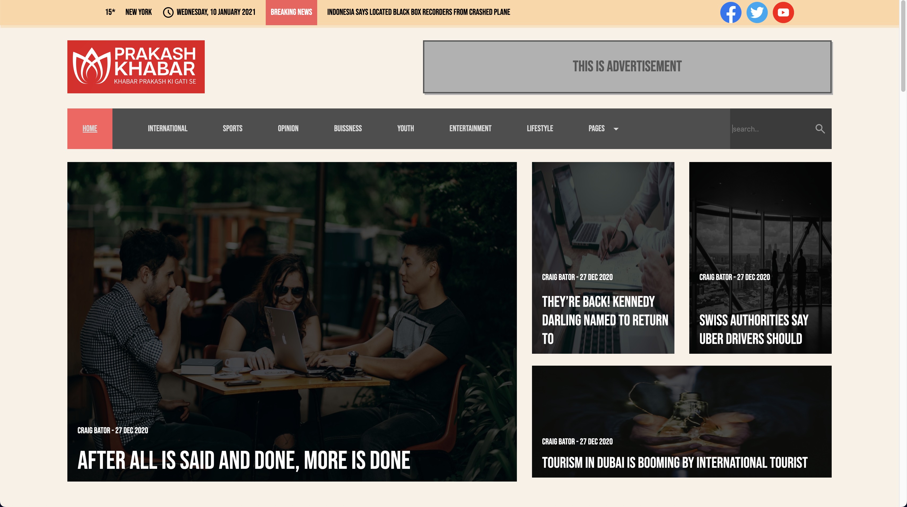
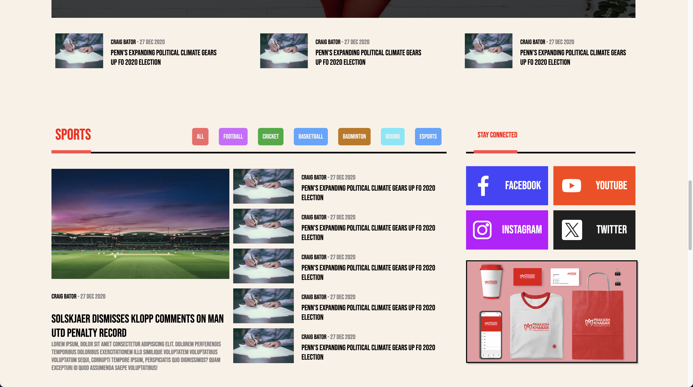

# Prakash Khabar (Under Dev.)
Prakash Khabar - Your Personalized News Application
## (Frontend practice project)
## (no youtube copy)
Prakash Khabar is a personalized news application developed using Vite and React. It offers users a tailored news browsing experience, integrating various APIs such as weather, location, and NewsAPI to provide up-to-date information.
Features

    Personalized News: Access curated news articles based on individual interests and preferences.
    Real-Time Weather Updates: Stay informed about current weather conditions in your location.
    Location-Based News: Receive news relevant to your geographical location.
    Responsive Design: Enjoy seamless browsing across different devices.
# Preview
Top->

sports section->

bottom->

Installation

    Clone the repository:

    bash

git clone https://github.com/ProPrak01/prakash-khabar.git

Navigate to the project directory:

bash

cd prakash-khabar

Install dependencies:

bash

    npm install

Usage

    Run the development server:

    bash

    npm run dev

    Open your browser and navigate to http://localhost:3000 to access the application.

Technologies Used

    Vite: Fast and optimized build tool for web projects.
    React: JavaScript library for building user interfaces.
    Axios: Promise-based HTTP client for making API requests.
    NewsAPI: API service providing access to news articles from various sources.
    OpenCageData API: Geocoding and reverse geocoding service for location-based functionality.
    WeatherAPI: API service offering weather data and forecasts.

Contributing

Contributions are welcome! Please fork the repository and submit a pull request with your changes.
License

This project is licensed under the MIT License. See the LICENSE file for details.
Author

Your Name
Acknowledgements

    Vite
    React
    NewsAPI
    OpenCageData API
    WeatherAPI

